# Task 2
CREATE TABLE member(
  id INT UNSIGNED PRIMARY KEY AUTO_INCREMENT,
  name VARCHAR(255) NOT NULL,
  email VARCHAR(255) NOT NULL,
  password VARCHAR(255) NOT NULL,
  follower_count INT NOT NULL DEFAULT 0,
  time DATETIME NOT NULL DEFAULT CURRENT_TIMESTAMP
);

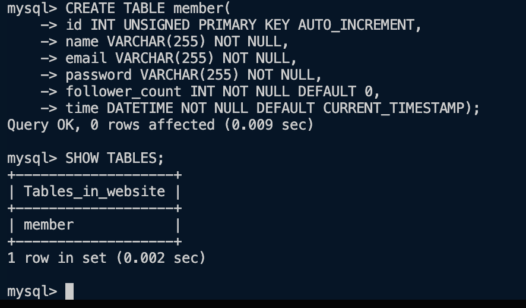

# Task 3
INSERT INTO member (name, email, password) VALUES ('test', 'test@test.com', 'test');
INSERT INTO member (name, email, password) VALUES ('monday', 'monday@test.com', 'monday');
INSERT INTO member (name, email, password) VALUES ('tuesday', 'tuesday@test.com', 'tuesday');
INSERT INTO member (name, email, password) VALUES ('wednesday', 'wednesday@test.com', 'wednesday');
INSERT INTO member (name, email, password) VALUES ('thursday', 'thursday@test.com', 'thursday');
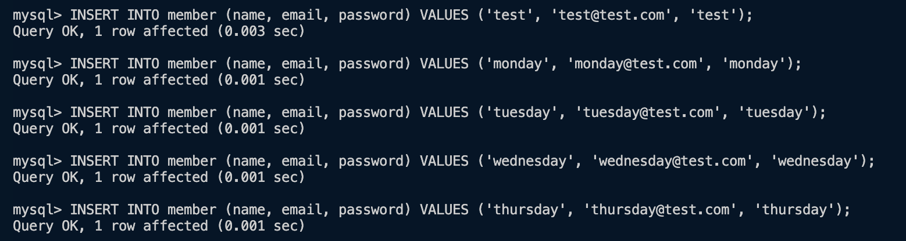
SELECT * FROM member;
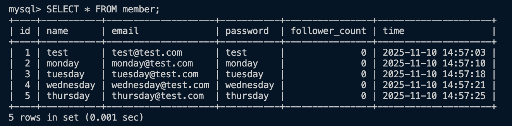
SELECT * FROM member ORDER BY time DESC;
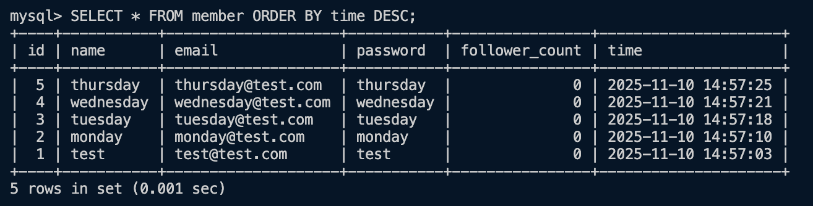
SELECT * FROM member ORDER BY time DESC LIMIT 3 OFFSET 1;
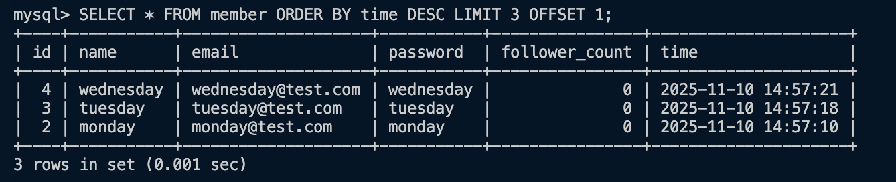
SELECT * FROM member WHERE email = 'test@test.com';
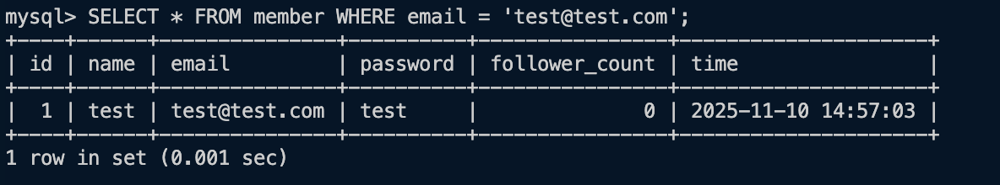
SELECT * FROM member WHERE name LIKE '%es%';
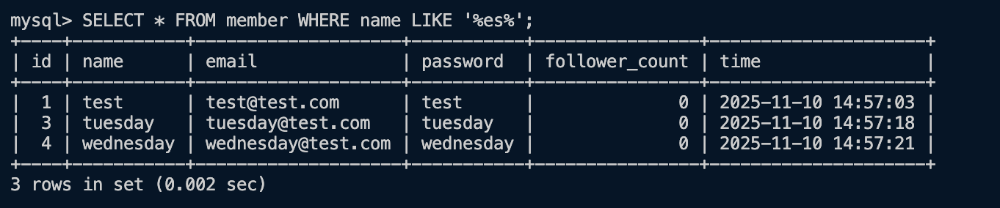
SELECT * FROM member WHERE email = 'test@test.com' AND password = 'test';
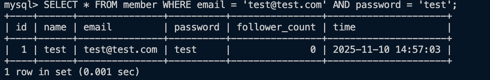
UPDATE member SET name = 'test2' WHERE email = 'test@test.com';
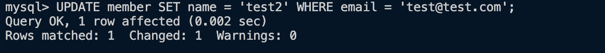

# Task 4
SELECT COUNT(*) FROM member;
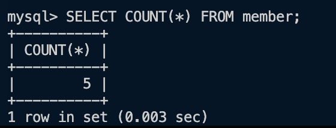
UPDATE member SET follower_count = FLOOR(RAND() * 100) WHERE id BETWEEN 1 AND 5;

SELECT SUM(follower_count) FROM member;
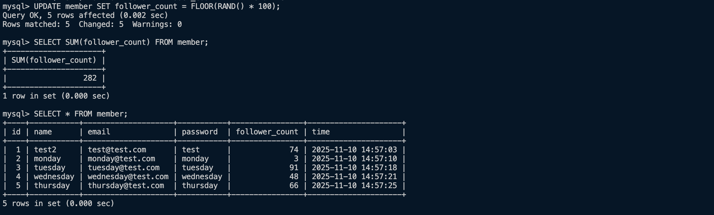
SELECT AVG(follower_count) FROM member;
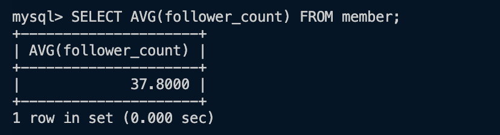
SELECT AVG(follower_count) AS avg_follower_count FROM (SELECT follower_count FROM member ORDER BY follower_count DESC LIMIT 2) AS top2;

# Task 5
CREATE TABLE message(
    id INT UNSIGNED PRIMARY KEY AUTO_INCREMENT,
    member_id INT UNSIGNED NOT NULL,
    content TEXT NOT NULL,
    like_count INT NOT NULL DEFAULT 0,
    time DATETIME NOT NULL DEFAULT CURRENT_TIMESTAMP,
    FOREIGN KEY (member_id) REFERENCES member (id)
);

INSERT INTO message(member_id, content, like_count) VALUES (FLOOR(RAND() * 5) + 1, 'This is good!', FLOOR(RAND() * 10));
INSERT INTO message(member_id, content, like_count) VALUES (FLOOR(RAND() * 5) + 1, 'NICE!!!', FLOOR(RAND() * 10));
INSERT INTO message(member_id, content, like_count) VALUES (FLOOR(RAND() * 5) + 1, 'GOOD!!!', FLOOR(RAND() * 10));
INSERT INTO message(member_id, content, like_count) VALUES (FLOOR(RAND() * 5) + 1, 'So good!!!', FLOOR(RAND() * 10));
INSERT INTO message(member_id, content, like_count) VALUES (FLOOR(RAND() * 5) + 1, 'LOVE it!!!', FLOOR(RAND() * 10));
INSERT INTO message(member_id, content, like_count) VALUES (FLOOR(RAND() * 5) + 1, 'Omg bro!', FLOOR(RAND() * 10));
INSERT INTO message(member_id, content, like_count) VALUES (FLOOR(RAND() * 5) + 1, 'On fire!', FLOOR(RAND() * 10));
INSERT INTO message(member_id, content, like_count) VALUES (FLOOR(RAND() * 5) + 1, 'Kepp going!', FLOOR(RAND() * 10));
INSERT INTO message(member_id, content, like_count) VALUES (FLOOR(RAND() * 5) + 1, 'I knew you can do it!', FLOOR(RAND() * 10));
INSERT INTO message(member_id, content, like_count) VALUES (FLOOR(RAND() * 5) + 1, 'Good for you man!', FLOOR(RAND() * 10));
INSERT INTO message(member_id, content, like_count) VALUES (FLOOR(RAND() * 5) + 1, 'So proud of you!', FLOOR(RAND() * 10));
INSERT INTO message(member_id, content, like_count) VALUES (FLOOR(RAND() * 5) + 1, 'My idol!', FLOOR(RAND() * 10));
INSERT INTO message(member_id, content, like_count) VALUES (FLOOR(RAND() * 5) + 1, 'Excellent!', FLOOR(RAND() * 10));
INSERT INTO message(member_id, content, like_count) VALUES (FLOOR(RAND() * 5) + 1, "Let's do it!", FLOOR(RAND() * 10));
INSERT INTO message(member_id, content, like_count) VALUES (FLOOR(RAND() * 5) + 1, 'THE GOAT', FLOOR(RAND() * 10));

SELECT * FROM message JOIN member ON message.member_id = member.id;
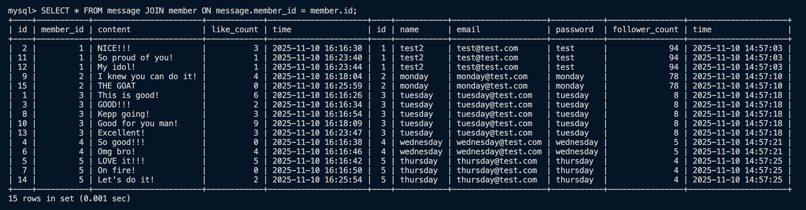
SELECT * FROM message JOIN member ON message.member_id = member.id WHERE member.email = 'test@test.com';
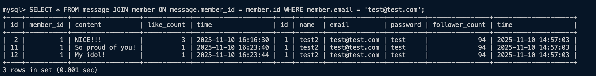
SELECT AVG(like_count) FROM message JOIN member ON message.member_id = member.id WHERE member.email = 'test@test.com';

SELECT AVG(like_count), email FROM message JOIN member ON message.member_id = member.id GROUP BY email;
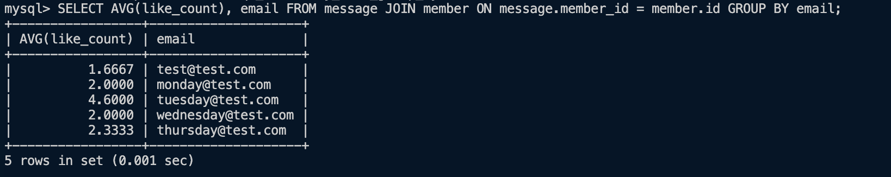